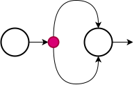

# Foundations :: Program structure

<figure style="text-align: center">

   
   <figcaption>JavaScript</figcaption>
</figure>

## 1 :: Expressions and declarations

A piece of code that produces a value is called an expression. Expressions can contain other expressions in a similar way to how subsentences in human languages are nested.
If an expression corresponds to a fragment, a JS statement corresponds to a complete sentence. A program is a list of statements.

An expression can simply produce a value. However, a statement stands on its own, so if it doesn't affect the world, it's useless. It can display something on the screen or change the state of the machine in a way that will affect statements that come after it. These changes are called _side effects_.

## 2 :: Bindings

To catch and hold values, JavaScript provides a thing called a binding, or variable:

```js
let product = 2 * 4;
```

The `let` keyword indicates that this phrase is going to define a binding. The example creates a binding called _product_ and uses it to grab the number that is produced when solving the arithmetic operation.

Its name can be used as an expression and the value of that expression is the value that the binding currently maintains.

```js
let product = 2 * 4;
console.log(product + 2); // 10
```

That doesn't mean you're tied to this value forever. The = operator can be used at any time on existing links to disconnect them from their current value and make them point to a new one

```js
let product = 2 * 4;
console.log(product + 2); // 10

product = 18;
console.log(product + 2); // 20
```

> [!NOTE]  
> JS provides three different ways to define and initialize variables: var, const and let. We will deeply analyze them in the following chapters.

You should imagine the bindings as arrows instead of boxes. They do not contain values; they point to the place where value is stored and grab it. This is the reason why two bindings can reference the same value (we will analyze later pros and cons of this behavior). A program can only access values to which it still has a reference.

Once you define a binding without giving it a value, there's nothing to grab, so it ends up in the air. If you request the value of an empty binding, you will get the value undefined.

```js
let name;
console.log(name); // undefined
```

## 3 :: Environment

The collection of bindings and their values that exist at any given time is called the _environment_. When a program starts, this environment is not empty. Always contains bindings that are part of the standard language.

> [!TIP]  
> In a browser, there are functions to manipulate dates, request data, interact with the user or read mouse and keyboard input. This whole set of functionalities are known as the **Web APIs**.

## 4 :: Functions

A function is a program fragment wrapped in a value. These values can be applied to execute the wrapped program.

Executing a function is called _invoking_, _calling_ or _applying_, by putting parentheses after an expression that produces a function value. Usually you will directly use the name of the binding that contains the function.

The values in parentheses are passed to the program within the function.

```js
function sum(value1, value2) {
  return value1 + value2;
}

console.log(sum(1, 2)); // 3
```

## 5 :: Return values

Showing a dialog box or typing text on the screen is a side effect. Many functions are useful because of the side effects they produce. Functions can also produce values, in which case they do not need to have a side effect to be useful.

> [!NOTE]  
> A _command_ is an instruction with the intention to change something and doesn't return a value. A _query_ is a request for information that doesn't change the system's state or cause any side effects and returns a value. So, functions which produce side-effects are _commands_ and functions which return values are _queries_.

Function `sum`, defined as example in previous section, takes two values as argument and returns its addition.

When a function produces a value, it is said to return that value. Anything that produces a value is an expression, which means that function calls can be used within larger expressions.

```js
function sum(value1, value2) {
  return value1 + value2;
}

console.log(sum(1, 2) + 5); // 8
```

## 6 :: Control flow

Sentences are executed sequentially from top to bottom.

```js
let randomNumber = Math.floor(Math.random() * 10);
console.log(
  `Your random number is ${randomNumber} and its square is ${
    randomNumber * randomNumber
  }`
);
```

This is the algorith sequence:

1. Define variable `randomNumber`
2. Initialize it with the rounded value in between 0-9 (`Math.foor()`) returned by `Math.random()`.
3. Log a message using a template string.

This is the schematic representation of a sequential flow:


### 6.1 :: if/else

Not all programs are straight paths. We might create a branching road where the program takes the appropriate branch based on the situation at hand.

```js
let randomNumber = Math.floor(Math.random() * 10);

if (randomNumber > 5) {
  console.log(`${randomNumber} is greater than 5`);
}
```

- the `if` keyword executes or skips a statement depending on the value of a Boolean expression. The decision expression is written after the keyword, in parentheses
- the statement after the if is wrapped in curly braces (`{` and `}`). Braces can be used to group any number of statements into a single statement, called a _block_.

You may handle code that requires taking in account other cases. This alternative route is represented by the second arrow in the diagram. You can use the `else` keyword, along with if, to create two separate, alternative execution paths.

```js
let randomNumber = Math.floor(Math.random() * 10);

if (randomNumber > 5) {
  console.log(`${randomNumber} is greater than 5`);
} else {
  console.log(`${randomNumber} is equal or less than 5`);
}
```

You can chain” multiple if/else pairs if you have more than two paths to choose from.

```js
let randomNumber = Math.floor(Math.random() * 10);

if (randomNumber > 5) {
  console.log(`${randomNumber} is greater than 5`);
} else if (randomNumber === 5) {
  console.log(`${randomNumber} is equal to 5`);
} else {
  console.log(`${randomNumber} is less than 5`);
}
```

This is the schematic representation of a conditional flow:



### 6.2 :: loops

In JS, a loop is a programming construct that allows you to repeatedly execute a block of code as long as a specified condition is true. Loops are essential for automating repetitive tasks and iterating over data structures.

#### 6.2.1 :: while and do

Consider a program that prints all even numbers from 0 to 12.

```js
console.log(0);
console.log(2);
console.log(4);
console.log(6);
console.log(8);
console.log(10);
console.log(12);
```

That works, but if we needed all even numbers less than 1,000, this approach would be infeasible. What we need is a way to execute a piece of code multiple times.

Flow control using loops allows us to return to some point in the program where we were before and repeat it with our current program state. If we combine this with a variable that counts, we can do something like this:

```js
let number = 0;

while (number <= 12) {
  console.log(number);
  number = number + 2;
}
```

How does it work?

- the `while` keyword creates a loop, followed by an expression in parentheses (`(number <= 12)`).
- the `while` keyword requires a block statement, similar to if, which contains the logic to execute at every iteration.
- the loop continues executing that statement as long as the expression produces a value that becomes true when converted to Boolean.
- each time the loop repeats, 'number' gets a value that is 2 more than its previous value. At the beginning of each repetition, it is compared with the number 12 to decide if the work of the program is finished.

A `do/while` loop is a control structure similar to a `while`. The only difference is that a **do loop always executes its body at least once**, and starts testing whether it should stop only after that first execution.

```js
let number = 0;

do {
  number = number + 2;
  console.log(number);
} while (number < 0);
```

This program will log number at least once. Then `while` condition will be evaluated and `do` statement will be executed again if condition is true.

This is the schematic representation of a while loop:


#### 6.2.2 :: for loop

Many loops follow the pattern shown in the while examples:

1. a _counter”_ variable is created to track the progress of the loop.
2. next comes a _while_ loop, usually with a test expression that checks whether the counter has reached its final value.
3. at the end of the loop body, the counter is updated to track progress.

Because this pattern is so common, JS and similar languages provide a slightly shorter and more complete form, the `for` loop:

```js
for (let number = 0; number <= 12; number = number + 2) {
  console.log(number);
}
```

The parentheses after the for keyword must contain two semicolons.

1. The part before the first semicolon (`let number = 0;`) initializes the loop, usually by defining a variable.
2. The second part (`number <= 12;`) is the expression that checks if the loop should continue.
3. The final part (`number = number + 2`) updates the state of the loop after each iteration. In most cases, this is shorter and clearer than a traditional while.

#### 6.2.3 :: Breaking out of a loop

Making the loop condition produce false is not the only way a loop can terminate. The `break` statement has the effect of immediately exiting the loop that contains it.

```js
for (let number = 1; ; number = number + 1) {
  if (number % 8 === 0) {
    console.log(number);
    break;
  }
}
```

The for construct in the example does not have defined the second part, the one that checks the end of the loop. This means that the loop will never stop unless the break statement is executed within it.

> [!WARNING]  
> Loops must define a guard clause to escape from it. If you remove `break` statement or accidentally write an end condition that always returns true, your program would be trapped in an infinite loop.... bad thing.

The `continue` keyword is similar to break in that it influences the progress of a loop. When continue is encountered in the body of a loop, the control jumps out of the body and continues to the next iteration of the loop.

### 6.3 :: switch

Be careful with nested `if/else` structure. It can be difficult to read and maintain.

```js
if (x == "value1") action1();
else if (x == "value2") action2();
else if (x == "value3") action3();
else defaultAction();
```

In this case it's better to call `switch` statement, that is intended to express if/else nested structure in a more direct way.

```js
switch (prompt("How's the weather?")) {
  case "rainy":
    console.log("Remember to bring an umbrella.");
    break;
  case "sunny":
    console.log("Dress lightly.");
  case "cloudy":
    console.log("Go outside.");
    break;
  default:
    console.log("Unknown weather type!");
    break;
}
```

The program will begin running on the label that corresponds to the value given to switch, or on default if no matching value is found. It will continue to execute, even through other tags, until it reaches a break statement.

## 7 :: Code conventions

### 7.1 :: Variables naming

In JS, there are common naming conventions that developers typically follow to improve code readability and maintainability. Two widely used conventions for naming variables, functions, and other identifiers are camelCase and PascalCase.

> [!NOTE]  
> These conventions are not enforced by the JS language itself, but they are widely adopted in the JS community. Consistently following these conventions makes your code more readable and helps other developers understand your code more easily.

#### 7.1.1 :: camelCase

- Starts with a lowercase letter.
- Subsequent words are capitalized, without spaces.
- Typically used for variable names, function names, and object properties.

```js
var myVariableName = "example";

function doSomething() {
  // function body
}
```

#### 7.1.2 :: PascalCase

- Starts with an uppercase letter.
- Subsequent words are capitalized, without spaces.
- Typically used for constructor functions, classes or components in JavaScript.

```js
function MyConstructor() {
  // constructor body
}

const MyComponent = (props) => {
  // JSX component body
};
```

#### 7.1.3 :: snake_case

- All lowercase letters.
- Words are separated by underscores (\_).
- Commonly used in languages like Python and for certain naming conventions in JavaScript, especially in cases where camelCase isn't preferred.

```js
var my_variable_name = "example";

function do_something() {
  // function body
}
```

#### 7.1.4 :: kebab-case

- All lowercase letters.
- Words are separated by hyphens (-).
- Often used in URLs, HTML attributes, and sometimes in CSS.

```js
var my-variable-name = "example";
```

While _snake_case_ and _kebab-case_ are not as prevalent in JS as _camelCase_ and _PascalCase_, they are still used, particularly in specific contexts or when integrating with external systems that use these conventions.

> [!NOTE]  
> Consistency within a codebase or project is crucial, so it's essential to adhere to the chosen convention consistently throughout the codebase.

### 7.2 :: Indenting code

In the code examples spaces have been added in front of statements that are part of some other larger statement. These spaces are not necessary: the computer will accept the program perfectly without them.

The role of this indentation is to make the structure of the code more readable for humans. In code where new blocks are opened within other blocks, it can become difficult to see where one block ends and another begins.

With proper indentation, the visual shape of a program corresponds to the shape of the blocks within it. You can use two spaces, four spaces or tab characters. The important thing is that each new block adds the same amount of space.
