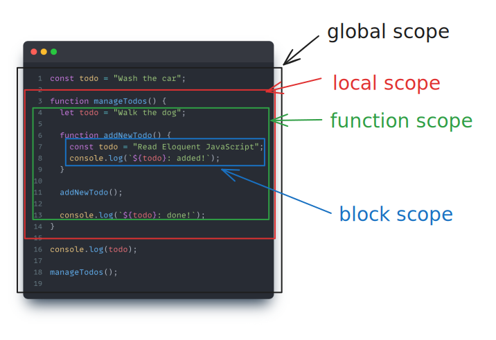

# Foundations :: Functions

<figure style="text-align: center">

   
   <figcaption>JavaScript</figcaption>
</figure>

> Wrapping a program fragment in a value has many uses. It provides us with a way to structure larger programs, reduce repetition, associate names with subprograms, and isolate these subprograms from each other. And allows us to define new vocabularies. This is a function

## 1 :: Defining a function

A function definition is a regular binding where the value of the binding is a function.

1. A function is created with an expression that begins with the `function` keyword.

```js
const feedMonkeys = function (fruit) {
  console.log(`Monkeys eat ${fruit}.`);
};
```

2. A function has a set of _parameters_ (in this case, just (`fruit`) and a _body_, which contains the statements that will be executed when the function is called. The body of a function created in this way must always be wrapped in curly braces `{...}`, even when it consists of a single statement.

3. A function can have multiple parameters or none at all.

```js
const sayHello = function () {
  console.log("Hello World!");
};

sayHello(); // `Hello World!`

const add = function (value1, value2) {
  return value1 + value2;
};

console.log(add(1, 2)); // 3
```

4. Some functions, such as `add` produce a value, and others do not, as `sayHello`.

> [!TIP]  
> See command/query concepts in section 02: _Program structure_.

5. A function with explicit `return` determines the value to be returned. When the control reaches such an instruction, it immediately jumps out of the function.

6. A function without explicit `return` returns implicitly `undefined`.

7. The parameters of a function behave like regular bindings, but their initial values are given as _arguments_ by the caller of the function, not by the code in the function itself.

## 2 :: Bindings and scopes

When we reference a variable, JS starts looking for its definition in the closest block and will continue searching in increasingly distant blocks until it finds an block where the variable is declared.

Each of these blocks is called a scope, which gives meaning to the variables and determines:

- the set of variables that we can access from a line of code
- the context of `this`
- `arguments` object in a function scope
- `window | global` object in a global scope

The scope in which each variable will be defined depends on how and where it is declared.

- _how_ refers to the type of declaration chosen: `var`, `let` or `const`.
- _where_ refers to the place where it is declared, whether freely outside any function or code block, within a function or within a common code block.

> [!NOTE]  
> _Context_ and _execution context_ (scope) are two very similar concepts but they are two different things in JS. **Context** has to do with the value that the _this_ variable has at some point during execution, binding it to the object that is executing a function.

### 2.1 :: Scopes

There are mainly two types of scope in JS:

#### 2.1.1 :: Global Scope

It's the default scope for all code running in script mode.

- Variables declared outside any function or block have global scope.
- They can be accessed from anywhere within the script, including inside functions and blocks.

```js
var globalVariable = 10;

function foo() {
  console.log(globalVariable); // Can access globalVariable
}

console.log(globalVariable); // Can access globalVariable
```

#### 2.1.2 :: Module Scope

It's a scope type in introduced with the ES6 module system. This scope helps encapsulate code within modules, preventing variable name clashes and providing a clear boundary for dependencies.

- Variables declared at the top level of a module (i.e., not inside any function or block) have module scope.
- Variables declared with `const`, `let`, or `var` at the top level of a module are scoped to that module and are not accessible outside of it unless explicitly exported.

```js
// module.js
const moduleVar = "Hello from module";

export function foo() {
  return moduleVar; // moduleVar is accessible here
}

// otherModule.js
import { foo } from "./module.js";

foo(); // 'Hello from module'
console.log(moduleVar); // Error: moduleVar is not defined
```

#### 2.1.3 :: Local Scope

Local scope is a characteristic of variables that makes them local (i.e., the variable name is only bound to its value within a scope which is not the global scope).

- Variables declared inside a function or block have local scope.
- They are only accessible within that function or block and are not visible to the outer scope.

```js
function foo() {
  var localVariable = 20;
  console.log(localVariable); // Can access localVariable
}

console.log(localVariable); // Error: localVariable is not defined
```

The local scope in turn defines two more scopes:

- function scope
- block scope

#### 2.1.4 :: Function Scope

It's the scope created by a function.

- Variables defined exclusively within the function cannot be accessed from outside the function or within other functions.
- Variables declared using var within a function are function-scoped. They are accessible only within the function in which they are declared.
- Variables declared with `let` or `const` can belong to this additional scope.

```js
function foo() {
  var localVar = 10;
  console.log(localVar); // localVar is accessible here
}
console.log(localVar); // Error: localVar is not defined
```

#### 2.1.5 :: Block Scope

- Variables declared using let or const within a block (enclosed within {}) are block-scoped. They are accessible only within that block.

```js
if (true) {
  let blockVar = 20;
  console.log(blockVar); // blockVar is accessible here
}
console.log(blockVar); // Error: blockVar is not defined
```

#### 2.1.6 :: Example



```js
const todo = "Wash the car";

function manageTodos() {
  let todo = "Walk the dog";

  function addNewTodo() {
    const todo = "Read Eloquent JavaScript";
    console.log(`${todo}: added!`);
  }

  addNewTodo();

  console.log(`${todo}: done!`);
}

console.log(todo);

manageTodos();

//'Read Eloquent JavaScript: added!'
//'Walk the dog: done!'
//'Wash the car'
```

```js
const todo = "Wash the car";

function manageTodos() {
  let todo = "Walk the dog";

  function addNewTodo() {
    console.log(`${todo}: added!`);
  }

  addNewTodo();

  console.log(`${todo}: done!`);
}

console.log(todo);

manageTodos();

// 'Walk the dog: added!'
// 'Walk the dog: done!'
// 'Wash the car'
```

```js
const todo = "Wash the car";

function manageTodos() {
  function addNewTodo() {
    console.log(`${todo}: added!`);
  }

  addNewTodo();

  console.log(`${todo}: done!`);
}

console.log(todo);

manageTodos();

// 'Wash the car: added!'
// 'Wash the car: done!'
// 'Wash the car'
```

## 3 :: Function definition

In JS, there are two main ways to define functions: function declarations and function expressions. The primary difference between them lies in how they are defined and hoisted.

> [!WARNING]  
> Hoisting is a JS process related to functions declaration. It will be treated in next secionts.

### 3.1 Function declaration

A function definition (also called a function declaration, or function statement) consists of the `function` keyword, followed by:

- The name of the function.
- A list of parameters to the function, enclosed in parentheses and separated by commas.
- The JS statements that define the function, enclosed in curly braces, `{ … }`.
- Function declarations are not part of the regular top-down control flow. Due _hoisting_ process they move to the beginning of their scope and can be used by all code in that scope.

```js
function square(number) {
  return number * number;
}
```

### 3.2 Function expression

While the function declaration above is syntactically a statement, functions can also be created by a function expression.

Such a function can be anonymous; it does not have to have a name. For example, the function square could have been defined as:

```js
const square = function (number) {
  return number * number;
};

console.log(square(4)); // 16
```

> [!NOTE]  
> It is possible to store a function value in a new variablew, pass it as an argument to a function, etc. Similarly, a variablew containing a function is still just a regular variablew and if it is not const, it can be assigned a new value. For this reason, in JS functions are considered **first level citizens**.

### 3.3 Arrow function

An arrow function expression (also called a fat arrow to distinguish from a hypothetical -> syntax in future JavaScript) has a shorter syntax compared to function expressions. Arrow functions are always anonymous.

```js
//function expression
const squareAsExpression = function (number) {
  return number * number;
};

console.log(squareAsExpression(4)); // 16

//arrow function
const squareAsArrowFunction = (number) => {
  return number * number;
};

console.log(squareAsArrowFunction(4)); // 16
```

Arrow functions allow immplicit return. Then key word `return` and brackets `{ ... }` can be ommitted.

```js
//explicit return
const squareWithExplicitReturn = function (number) {
  return number * number;
};

console.log(squareWithExplicitReturn(4)); // 16

//implicit return
const squareWithImplicitReturn = (number) => number * number;

console.log(squareWithImplicitReturn(4)); // 16
```

> [!NOTE]  
> Arrow functions were added in 2015, mainly to make it possible to write small function expressions in a less verbose way.

> [!WARNING]  
> Arrow functions don't have its own `this`, `arguments`, `super`, or `new.target`.

## Hoisting comparision

| type                 | definition | initialization | invocation before initialization |
| -------------------- | ---------- | -------------- | -------------------------------- |
| declaration function | ✅         | ✅             | ✅                               |
| expression function  | ✅         | ❌             | ❌                               |
| arrow function       | ✅         | ❌             | ❌                               |

## 4 :: Call stack

The call stack is a mechanism used to keep track of function calls in the execution context. When a script executes, JS keeps track of which functions are being called and in what order. This tracking is done using the call stack.

Here's how it works:

1. **Function Invocation**: When a function is called, JS adds it to the call stack to be executed. Each function call creates a new stack frame containing information about:

   - function's arguments
   - local variables
   - location in the code where the function was called from.

2. **Function Execution**: The function at the top of the call stack is the one currently being executed. JS executes the code inside this function until it reaches a return statement or the end of the function.

3. **Function Completion**: When a function completes its execution, it is removed from the call stack, and control is passed back to the calling function (if any).

4. **Stack Frames**: Each function call creates a new stack frame, which is a data structure containing information about the function call. Stack frames are organized in a last-in-first-out (LIFO) manner, meaning the most recently added function call is the first to be executed.

Here's a simple example to illustrate the call stack:

```js
function greet(name) {
  console.log("Hello, " + name + "!");
}

function sayHello() {
  greet("Alice");
}

function init() {
  sayHello();
}

init(); // This function call starts the call stack
```

In this example:

1. The `init` function is called, so it's added to the call stack.
2. Inside `init`, `sayHello` is called, so it's added to the call stack on top of `init`.
3. Inside `sayHello`, `greet` is called, so it's added to the call stack on top of `sayHello`.
4. When greet completes its execution, it's removed from the call stack, and control goes back to `sayHello`.
5. Similarly, when `sayHello` completes, it's removed from the call stack, and control goes back to `init`.
6. Finally, when `init` completes, it's removed from the call stack, and the call stack becomes empty.

> [!TIP]  
> Visualize JS call stack online [here [↗]](https://www.jsv9000.app/).

## 5 :: Closures

In JS, closures are an important concept that involves the combination of functions and the lexical environment in which they are defined.

A closure occurs when a function is defined within another function (the outer function) and has access to the outer function's variables. These inner functions "remember" the environment in which they were created, even after the outer function has finished executing.

Here's how it works with scope and lexical environment:

- **Scope**: In JS, each function creates its own scope. This means that variables defined within a function are only accessible within that function (unless passed as arguments or captured in a closure).

- **Lexical Environment**: The lexical environment refers to the environment in which a piece of code is written, including variables, functions, and their scope. When a function is defined, it retains access to its lexical environment, even if it is executed outside of that environment.

So, when a function is defined within another function, it captures (closes over) the variables from the outer function's scope. This allows the inner function to access those variables even after the outer function has finished executing.

Here's an example:

```js
function counter() {
  let value = 0;

  return function increase() {
    value++; // increase has access to value
    return value;
  };
}

let counter1 = counter(); // counter1 now holds a reference to increase function
counter1(); // This will return value
```

In this example, `increase` has access to the `value` variable declared in `counter`, even though `counter` has already finished executing. This is possible because `increase` forms a closure over the lexical environment of `counter`, capturing the variable `value`.

This example also shows the two main closures properties.

1. **Protected access to variables**. Variables are accessible to the inner function but are not directly accessible or modifiable from outside the scope of the outer function. This property helps in protecting variables from unintended modification or access from external code.

1. **Function factories**. A function factory is a function that returns another function. It's called a "factory" because it generates and returns functions based on some parameters or configurations provided to it. Closures are often used within function factories to capture and retain the context in which they were created.
